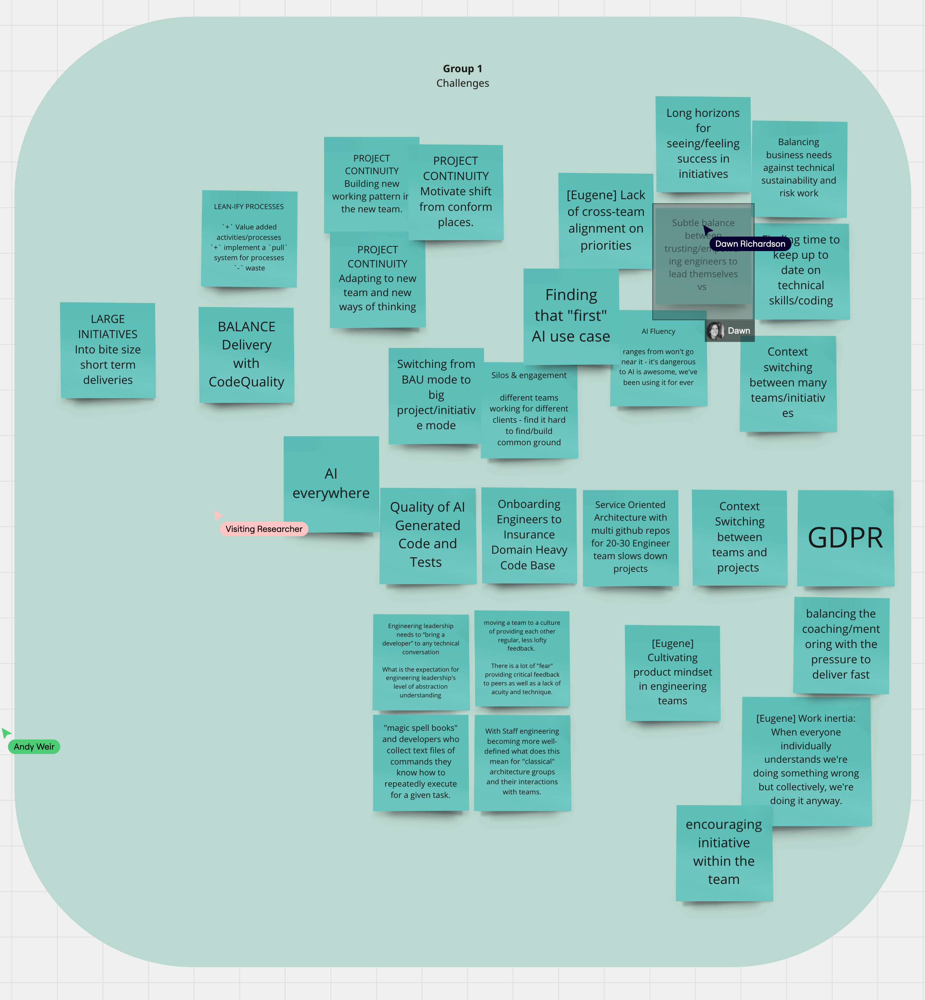
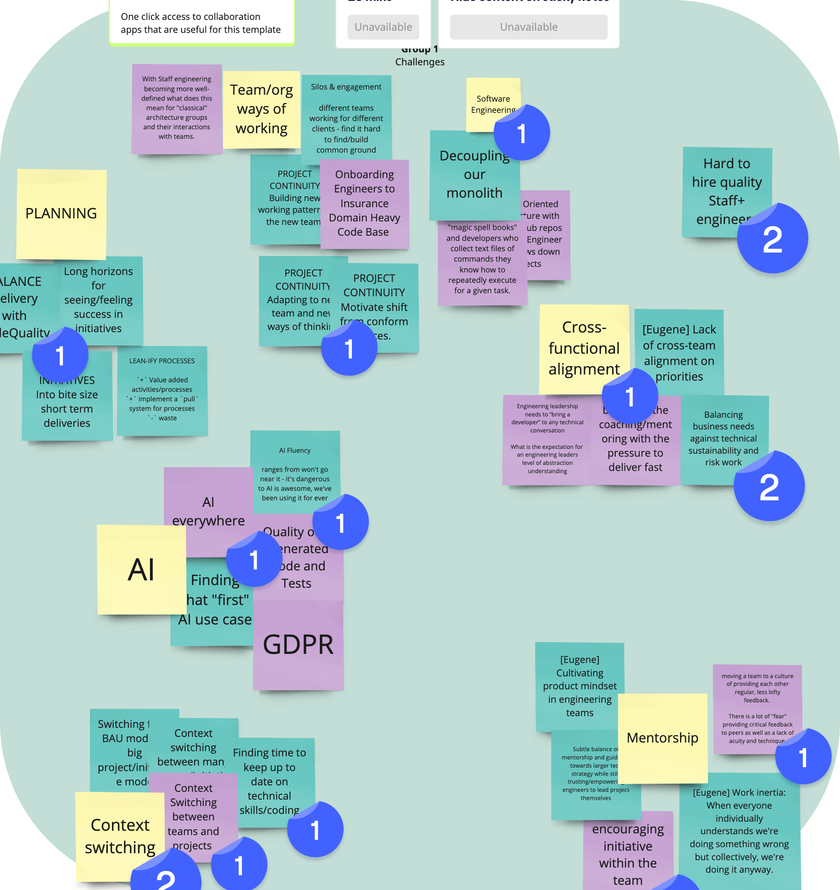
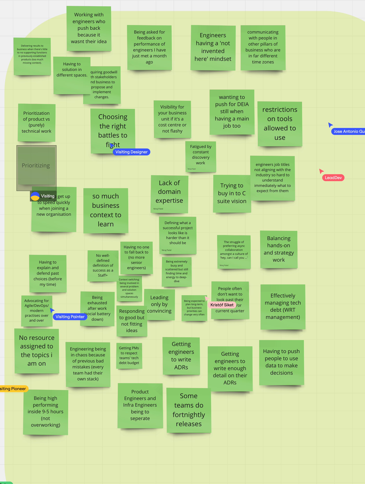
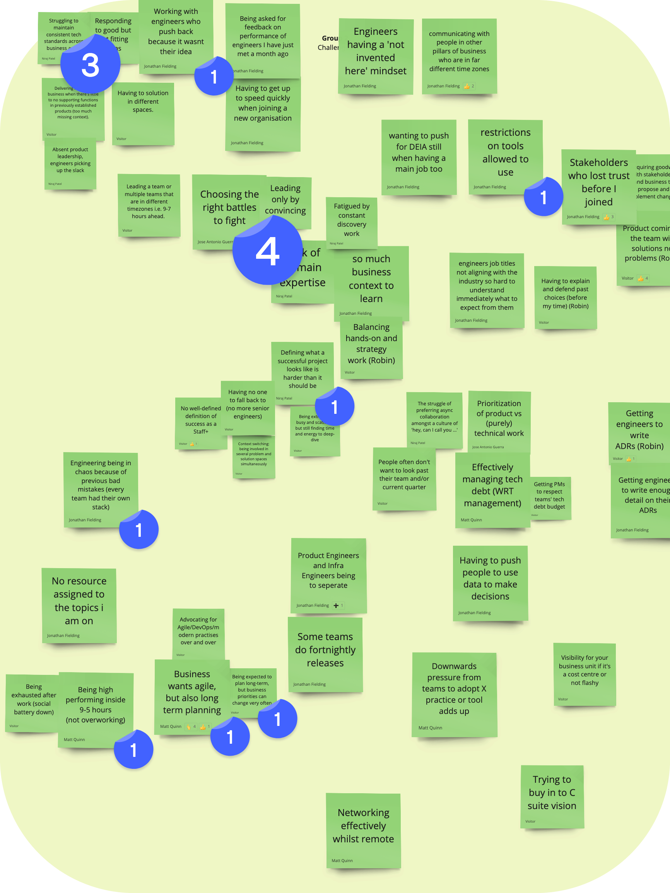

# CURRENT CHALLENGES

PROJECT CONTINUITY / HAVE MOVED LOTS IN THE LAST YEARS

- PROJECT CONTINUITY Adapting to new team and new ways of thinking.
- PROJECT CONTINUITY Building new working pattern in the new team.
- PROJECT CONTINUITY Motivate shift from conform places.

- SECURE ENV, FAIL -> FIX, CHALLENGE IDEAS

LEAN-IFY PROCESSES

`+` Value added activities/processes
`+` implement a `pull` system for processes
`-` waste

- Forward thinking. taking initiative.

INITIATIVES (ARCHITECTURE) BOOK_KEEPING/DOCUMENTATION

NAVIGATE TOXIC PEOPLE (Political Animals | Animal Politics)

INFLUENCE => DEFEND INITIATIVES

Dealing with change on processes.

Toxic

- Human factor

# CLOSE

`Please share a tip with the group that has helped you become a more effective individual contributor / engineering leader.`

PATIENCE
To build relationships (find open minded peers).

- Observe -> Suggest improvements

LINK TECH DEBT TO PROD INITIATIVES

To re-adapt to several rounds of leadership adjustments.

WHOLEHEARTED RELATIONSHIPS (Brené Brown)

Built on sincere appreciation, openness and trust.
Help to navigate heavily political figures.

# WHAT THEY LIKE

- MENTORING

- BAU TO TECH LINK

- ENJOYMENT OF WORK COMPLETED BY THE TEAM

# OTHERS'S CHALLENGES

- Context shifting
- AI -> ???
- LArge codebases

  - Onboarding hard

- AI TOOLS LITERACY

- BALANCE NO LOOSING TECH SKILLS

# LINKEDIN

https://www.linkedin.com/in/bgarciagil/

Derik (13 Mar 2025, 18:27)
https://www.linkedin.com/in/derikevangelista/

Niraj Patel (13 Mar 2025, 18:27)
https://www.linkedin.com/in/niraj-patel-ab968233/

Matt Quinn (13 Mar 2025, 18:27)
https://www.linkedin.com/in/mquinn960/

Dawn (13 Mar 2025, 18:27)
https://www.linkedin.com/in/dawner/

Robin Pokorný (13 Mar 2025, 18:27)
https://www.linkedin.com/in/robinpokorny/

Jonathan Fielding (13 Mar 2025, 18:28)
https://www.linkedin.com/in/jonathanfielding/

Andy W - Headforwards - Cornwall, UK (13 Mar 2025, 18:28)
https://www.linkedin.com/in/andyrlweir/

WIll (13 Mar 2025, 18:28)
https://www.linkedin.com/in/will-fasuyi-a434b0a0/
